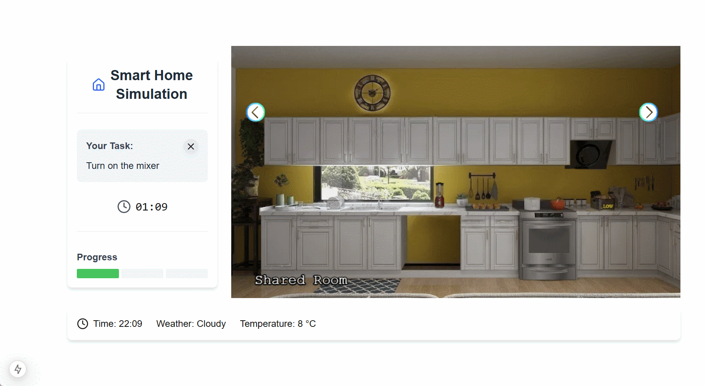
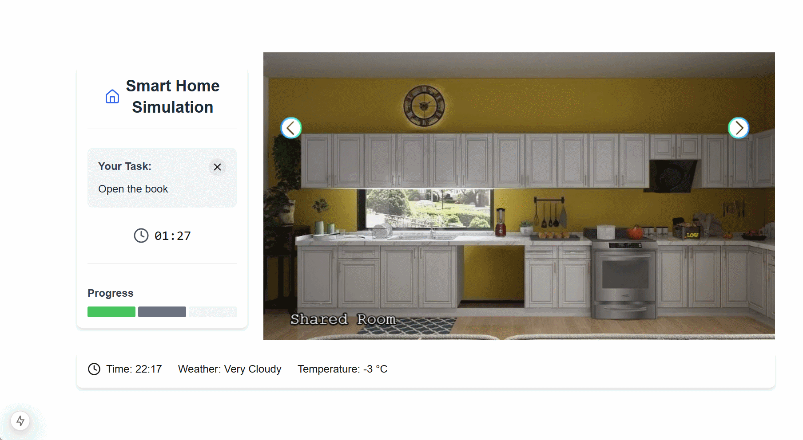
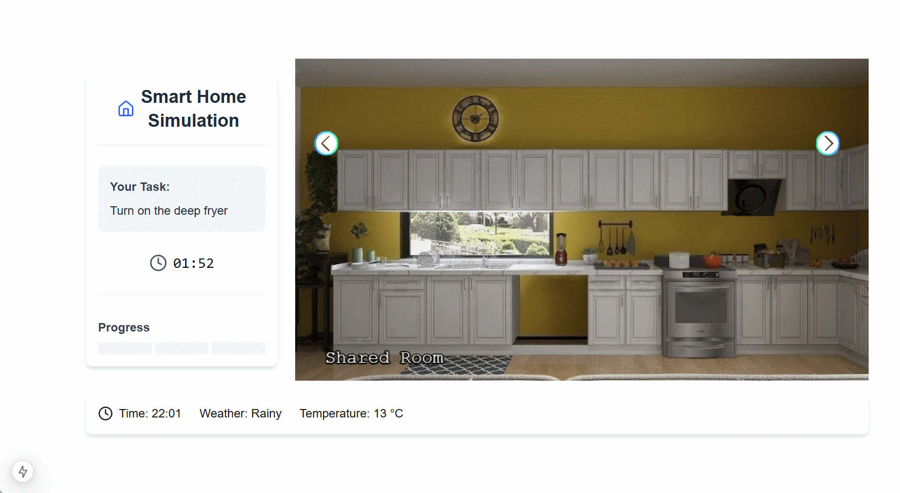

# Default Scenario
# Introduction

The Default Scenario is the standard setup loaded when the base Docker (Compose) image is launched. It features a smart home environment with three rooms:
- Living Room
- Bob’s Room
- Participant's Room

In this scenario, the user is expected to complete three tasks, each associated with a contextual smart home rule:

| # | Task                   | Involved Automation / Rule                                  |
|---|------------------------|--------------------------------------------------------------|
| 1 | Turn on the Deep Fryer | Deep Fryer only turns on when the Cooker Hood is on          |
| 2 | Turn on the Mixer      | Mixer automatically turns off after 22:00                    |
| 3 | Open Book in Your Room | Lamp turns on 3 seconds after the book is opened             |

### **Dynamics for Each Task**

-   **Task 1: Turn on the Deep Fryer**
This task is affected by a rule that requires the cooker hood to be active. The fryer cannot be turned on unless this condition is met, creating a _resolvable conflict_. The explanation is meant to help the user recognize and address the dependency, enabling successful task completion.
    
-   **Task 2: Turn on the Mixer**
 This task is governed by a time-based rule that disables the mixer after 22:00. If attempted during restricted hours, the task cannot be completed, and the conflict is _not resolvable_ by user action. The explanation helps users understand the reason for failure and encourages them to stop pursuing the task.
    
-   **Task 3: Open Book in Your Room**
This task can be completed without any conflicts. However, a related automation (lamp turns on with a delay) may surprise the user. Although the behavior does not block task completion, an explanation is available to clarify the system’s response and maintain transparency.

In all cases, explanations are configured to be shown automatically (push-based) when the user fails to complete a task. For the sake of demonstration, we use a simplified explanation approach—namely, an integrated explanation—where a specific explanation is directly mapped to each task. This means that the same explanation is shown to all users whenever that task is not successfully completed.

| Task                   | Explanation Shown                                                   |
|------------------------|----------------------------------------------------------------------|
| #1 | As long as the cooker hood is off, the deep fryer remains off.      |
| #2     | The mixer cannot be turned on after 22:00.                          |
| #3 | The lamp is turned on because the room is dark                      |

# Configuration File 


## game.json

```json
{
    "environment": {
        "time": {
            "startTime": {
                "hour": 22,
                "minute": 0
            },
            "speed": 10
        }
    },
    "rules": [
        {
            "id": "deep_fryer_rule",
            "name": "Deep Fryer Only On When Cooker Hood Is On",
            "precondition": [
                {
                    "type": "Device",
                    "device": "cooker_hood",
                    "condition": {
                        "name": "Power",
                        "operator": "==",
                        "value": false
                    }
                },
                {
                    "type": "Device",
                    "device": "deep_fryer",
                    "condition": {
                        "name": "Power",
                        "operator": "==",
                        "value": true
                    }
                },
                {
                    "type": "Context",
                    "condition": {
                        "name": "task",
                        "operator": "==",
                        "value": "deep_fryer"
                    }
                }
            ],
            "action": [
                {
                    "type": "Device_Interaction",
                    "device": "deep_fryer",
                    "interaction": {
                        "name": "Power",
                        "value": false
                    }
                },
                {
                    "type": "Explanation",
                    "explanation": "deep_fryer_01"
                }
            ]
        },
        {
            "id": "mixer_rule",
            "name": "Turn Off Mixer After 22:00",
            "precondition": [
                {
                    "type": "Time",
                    "condition": {
                        "operator": ">=",
                        "value": "22:00"
                    }
                },
                {
                    "type": "Device",
                    "device": "mixer",
                    "condition": {
                        "name": "Power",
                        "operator": "==",
                        "value": true
                    }
                },
                {
                    "type": "Context",
                    "condition": {
                        "name": "task",
                        "operator": "==",
                        "value": "turn_on_mixer"
                    }
                }
            ],
            "action": [
                {
                    "type": "Device_Interaction",
                    "device": "mixer",
                    "interaction": {
                        "name": "Power",
                        "value": false
                    }
                },
                {
                    "type": "Explanation",
                    "explanation": "mixer_01"
                }
            ]
        },
        {
            "id": "book_rule",
            "name": "Turn On Lamp When Book Is Open",
            "precondition": [
                {
                    "type": "Device",
                    "device": "book",
                    "condition": {
                        "name": "Open",
                        "operator": "==",
                        "value": true
                    }
                }
            ],
            "delay": 3,
            "action": [
                {
                    "type": "Device_Interaction",
                    "device": "lamp",
                    "interaction": {
                        "name": "Power",
                        "value": true
                    }
                },
                {
                    "type": "Explanation",
                    "explanation": "lamp_01"
                }
            ]
        }
    ],
    "tasks": {
        "ordered": "true",
        "timer": 120,
        "abortable": true,
        "tasks": [
            {
                "id": "deep_fryer",
                "description": "Turn on the deep fryer",
                "timer": 120,
                "abortable": false,
                "abortionOptions": [
                    "I believe this task is impossible.",
                    "I want to skip this task."
                ],
                "environment": [
                    { "name": "Weather", "value": "Rainy" },
                    { "name": "Temperature", "value": "13 °C" }
                ],
                "defaultDeviceProperties": [
                    {
                        "device": "deep_fryer",
                        "properties": [
                            { "name": "Power", "value": false }
                        ]
                    },
                    {
                        "device": "mixer",
                        "properties": [
                            { "name": "Power", "value": true }
                        ]
                    }
                ],
                "goals": [
                    {
                        "device": "deep_fryer",
                        "condition": {
                            "name": "Power",
                            "operator": "==",
                            "value": true
                        }
                    }
                ]
            },
            {
                "id": "turn_on_mixer",
                "description": "Turn on the mixer",
                "timer": 120,
                "abortable": true,
                "abortionOptions": [
                    "I believe this task is impossible.",
                    "I want to skip this task.",
                    "I believe the mixer is broken"
                ],
                "environment": [
                    { "name": "Weather", "value": "Cloudy" },
                    { "name": "Temperature", "value": "8 °C" }
                ],
                "defaultDeviceProperties": [
                    {
                        "device": "mixer",
                        "properties": [
                            { "name": "Power", "value": false }
                        ]
                    }
                ],
                "goals": [
                    {
                        "device": "mixer",
                        "condition": {
                            "name": "Power",
                            "operator": "==",
                            "value": true
                        }
                    }
                ]
            },
            {
                "id": "book",
                "description": "Open the book",
                "abortable": true,
                "timer": 120,
                "abortionOptions": [
                    "I believe this task is impossible.",
                    "I want to skip this task."
                ],
                "environment": [
                    { "name": "Weather", "value": "Very Cloudy" },
                    { "name": "Temperature", "value": "-3 °C" }
                ],
                "defaultDeviceProperties": [
                    {
                        "device": "book",
                        "properties": [
                            { "name": "Open", "value": false }
                        ]
                    },
                    {
                        "device": "lamp",
                        "properties": [
                            { "name": "Power", "value": false }
                        ]
                    }
                ],
                "goals": [
                    {
                        "device": "book",
                        "condition": {
                            "name": "Open",
                            "operator": "==",
                            "value": true
                        }
                    }
                ]
            }
        ]
    },
    "rooms": [
        {
            "name": "Shared Room",
            "walls": [
                {
                    "image": "assets/images/shared_room/wall1.webp",
                    "default": true,
                    "devices": [
                        {
                            "name": "Deep Fryer",
                            "id": "deep_fryer",
                            "position": {
                                "x": 657,
                                "y": 285,
                                "scale": 1,
                                "origin": 1
                            },
                            "interactions":
                            [
                                {
                                    "InteractionType": "Boolean_Action",
                                    "name": "Power",
                                    "inputData": {
                                        "valueType": ["PrimitiveType", "Boolean"],
                                        "unitOfMeasure": null,
                                        "type": {
                                            "True": "On",
                                            "False": "Off"
                                        }
                                    },
                                    "currentState": {
                                        "visible": true,
                                        "value": false
                                    }
                                },
                                {
                                    "InteractionType": "Numerical_Action",
                                    "name": "Temperature",
                                    "inputData": {
                                        "valueType": ["PrimitiveType", "Integer"],
                                        "unitOfMeasure": "°C",
                                        "type": {
                                            "Range": [0, 200],
                                            "Interval": [50]
                                        }
                                    },
                                    "currentState": {
                                        "visible": [
                                            { "name": "Power", "value": true }
                                        ],
                                        "value": 0
                                    }
                                }
                            ],
                            "visualState": [
                                { "default": true, "image": "assets/images/shared_room/devices/wall1_deepfryer.webp" },
                                {
                                "default": false,
                                "conditions": [
                                    { "name": "Power", "value": true },
                                    { "name": "Temperature", "operator": "<=", "value": 50 }
                                ],
                                "image": "assets/images/shared_room/devices/wall1_deepfryer_low_temp.webp"
                                },
                                {
                                    "default": false,
                                    "conditions": [
                                        { "name": "Power", "value": true },
                                        { "name": "Temperature", "operator": ">", "value": 50 },
                                        { "name": "Temperature", "operator": "<=", "value": 100 }
                                    ],
                                    "image": "assets/images/shared_room/devices/wall1_deepfryer_med_temp.webp"
                                },
                                {
                                    "default": false,
                                    "conditions": [
                                        { "name": "Power", "value": true },
                                        { "name": "Temperature", "operator": ">", "value": 100 },
                                        { "name": "Temperature", "operator": "<=", "value": 200 }
                                    ],
                                    "image": "assets/images/shared_room/devices/wall1_deepfryer_high_temp.webp"
                                }
                            ]
                        },
                        {
                            "name": "Mixer",
                            "id": "mixer",
                            "position": {
                                "x": 367,
                                "y": 280,
                                "scale": 0.25,
                                "origin": 1
                            },
                            "interactions":
                            [
                                {
                                    "InteractionType": "Boolean_Action",
                                    "name": "Power",
                                    "inputData": {
                                        "valueType": ["PrimitiveType", "Boolean"],
                                        "unitOfMeasure": null,
                                        "type": {
                                            "True": "On",
                                            "False": "Off"
                                        }
                                    },
                                    "currentState": {
                                        "visible": true,
                                        "value": false
                                    }
                                },
                                {
                                    "InteractionType": "Generic_Action",
                                    "name": "Mix Speed",
                                    "inputData": {
                                        "valueType": ["PrimitiveType", "String"],
                                        "unitOfMeasure": null,
                                        "type": {
                                            "String": {
                                                "Options": [
                                                    "Low",
                                                    "Medium",
                                                    "High"
                                                ]
                                            }
                                        }
                                    },
                                    "currentState": {
                                        "visible": [
                                            { "name": "Power", "value": true }
                                        ],
                                        "value": "Medium"
                                    }
                                },
                                {
                                    "InteractionType": "Dynamic_Property",
                                    "name": "Motor Temperature",
                                    "outputData": {
                                        "valueType": ["PrimitiveType", "String"],
                                        "unitOfMeasure": "°C"
                                    },
                                    "currentState": {
                                        "visible": true,
                                        "value": "25"
                                    }
                                },
                                {
                                    "InteractionType": "Stateless_Action",
                                    "name": "Pulse",
                                    "inputData": {
                                        "valueType": [
                                            "null",
                                            "null"
                                        ],
                                        "unitOfMeasure": "null"
                                    },
                                    "currentState": {
                                        "visible": [
                                            { "name": "Power", "value": true }
                                        ]
                                    }
                                }
                            ],
                            "visualState": [
                                { "default": true, "image": "assets/images/shared_room/devices/wall1_mixer.png" }
                            ]
                        },
                        {
                            "name": "Cooker Hood",
                            "id": "cooker_hood",
                            "position": {
                                "x": 659,
                                "y": 222,
                                "scale": 1,
                                "origin": 1
                            },
                            "interactions": [
                                {
                                    "InteractionType": "Boolean_Action",
                                    "name": "Power",
                                    "inputData": {
                                        "valueType": ["PrimitiveType", "Boolean"],
                                        "unitOfMeasure": null,
                                        "type": {
                                            "True": "On",
                                            "False": "Off"
                                        }
                                    },
                                    "currentState": {
                                        "visible": true,
                                        "value": false
                                    }
                                }
                            ],
                            "visualState": [
                                { "default": true, "image": "assets/images/shared_room/devices/wall1_cookerhood.webp" }
                            ]
                        }
                    ]
                },
                {
                    "image": "assets/images/shared_room/wall2.webp",
                    "default": false
                },
                {
                    "image": "assets/images/shared_room/wall3.webp",
                    "doors": [
                        {
                            "image": "assets/images/shared_room/doors/wall3_door.webp",
                            "position": {
                                "x": 595,
                                "y": 95,
                                "scale": 0.5
                            },
                            "destination": {
                                "room": "bob_room",
                                "wall": "wall1"
                            }
                        }
                    ]
                },
                {
                    "image": "assets/images/shared_room/wall4.webp",
                    "doors": [
                        {
                            "image": "assets/images/shared_room/doors/wall4_door.webp",
                            "position": {
                                "x": 425,
                                "y": 100,
                                "scale": 0.5
                            },
                            "destination": {
                                "room": "alice_room",
                                "wall": "wall1"
                            }
                        }
                    ]
                }
            ]
        },
        {
            "name": "Bob Room",
            "walls": [
                {
                    "image": "assets/images/bob_room/wall1.webp",
                    "default": false,
                    "doors": [
                        {
                            "image": "assets/images/bob_room/doors/wall1_door.webp",
                            "position": {
                                "x": 0,
                                "y": 24,
                                "scale": 0.5
                            },
                            "destination": {
                                "room": "shared_room",
                                "wall": "wall1"
                            }
                        }
                    ]
                },
                {
                    "image": "assets/images/bob_room/wall2.webp",
                    "default": false
                },
                {
                    "image": "assets/images/bob_room/wall3.webp",
                    "default": false
                },
                {
                    "image": "assets/images/bob_room/wall4.webp",
                    "default": false,
                    "doors": [
                        {
                            "image": "assets/images/bob_room/doors/wall4_door.webp",
                            "position": {
                                "x": 521,
                                "y": 85,
                                "scale": 0.5
                            },
                            "destination": {
                                "room": "shared_room",
                                "wall": "wall1"
                            }
                        }
                    ]
                }
            ]
        },
        {
            "name": "Alice Room",
            "walls": [
                {
                    "image": "assets/images/alice_room/wall1.webp",
                    "default": false,
                    "devices": [
                        {
                            "name": "Lamp",
                            "id": "lamp",
                            "position": {
                                "x": 525,
                                "y": 320,
                                "scale": 1,
                                "origin": 1
                            },
                            "interactions": [
                                {
                                    "InteractionType": "Boolean_Action",
                                    "name": "Power",
                                    "inputData": {
                                        "valueType": ["PrimitiveType", "Boolean"],
                                        "unitOfMeasure": null,
                                        "type": {
                                            "True": "On",
                                            "False": "Off"
                                        }
                                    },
                                    "currentState": {
                                        "visible": true,
                                        "value": false
                                    }
                                }
                            ],
                            "visualState": [
                                { "default": true, "image": "assets/images/alice_room/devices/wall1_lamp.webp" },
                                {
                                    "default": false,
                                    "conditions": [
                                        { "name": "Power", "value": true }
                                    ],
                                    "image": "assets/images/alice_room/devices/wall1_lampon.webp"
                                }
                            ]
                        },
                        {
                            "name": "Book",
                            "id": "book",
                            "position": {
                                "x": 590,
                                "y": 325,
                                "scale": 1,
                                "origin": 1
                            },
                            "interactions": [
                                {
                                    "InteractionType": "Boolean_Action",
                                    "name": "Open",
                                    "inputData": {
                                        "valueType": ["PrimitiveType", "Boolean"],
                                        "unitOfMeasure": null,
                                        "type": {
                                            "True": "Yes",
                                            "False": "No"
                                        }
                                    },
                                    "currentState": {
                                        "visible": true,
                                        "value": false
                                    }
                                }
                            ],
                            "visualState": [
                                { "default": true, "image": "assets/images/alice_room/devices/wall1_book.webp" },
                                {
                                    "default": false,
                                    "conditions": [
                                        { "name": "Open", "value": true }
                                    ],
                                    "image": "assets/images/alice_room/devices/wall1_bookopen.webp",
                                    "position": {
                                        "scale": 0.2
                                    }
                                }

                            ]
                        }
                    ],
                    "doors": [
                        {
                            "image": "assets/images/alice_room/doors/wall1_door.webp",
                            "position": {
                                "x": 0,
                                "y": 45,
                                "scale": 0.5
                            },
                            "destination": {
                                "room": "shared_room",
                                "wall": "wall1"
                            }
                        }
                    ]
                },
                {
                    "image": "assets/images/alice_room/wall2.webp",
                    "default": false
                },
                {
                    "image": "assets/images/alice_room/wall3.webp",
                    "default": false
                },
                {
                    "image": "assets/images/alice_room/wall4.webp",
                    "default": false,
                    "doors": [
                        {
                            "image": "assets/images/alice_room/doors/wall4_door.webp",
                            "position": {
                                "x": 530,
                                "y": 93,
                                "scale": 0.5
                            },
                            "destination": {
                                "room": "shared_room",
                                "wall": "wall1"
                            }
                        }
                    ]
                }
            ]
        }
    ]
}
```


## explanation.json


```json
{
    "explanation_trigger": "push",
    "explanation_engine": "integrated",
    "integrated_explanation_engine": {
        "mixer_01": "The mixer cannot be turned on after 22:00",
        "deep_fryer_01": "As long as the cooker hood is off, the deep fryer remains off.",
        "lamp_01": "The lamp is turned on because the room is dark."
    },
    "explanation_rating": "like"
}
```

## Previews


**Deep Fryer Task**


**Mixer Task**



**Book Task**





